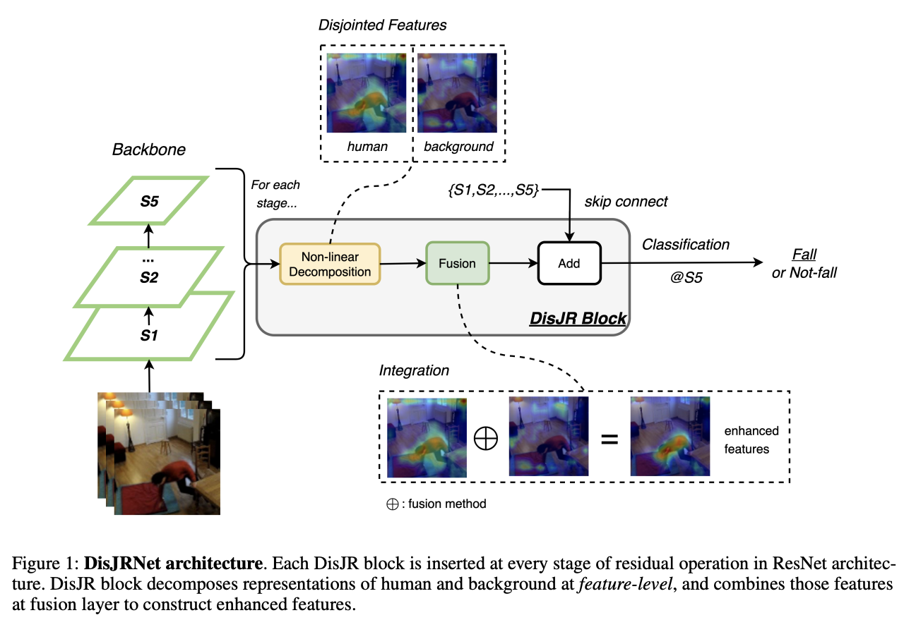
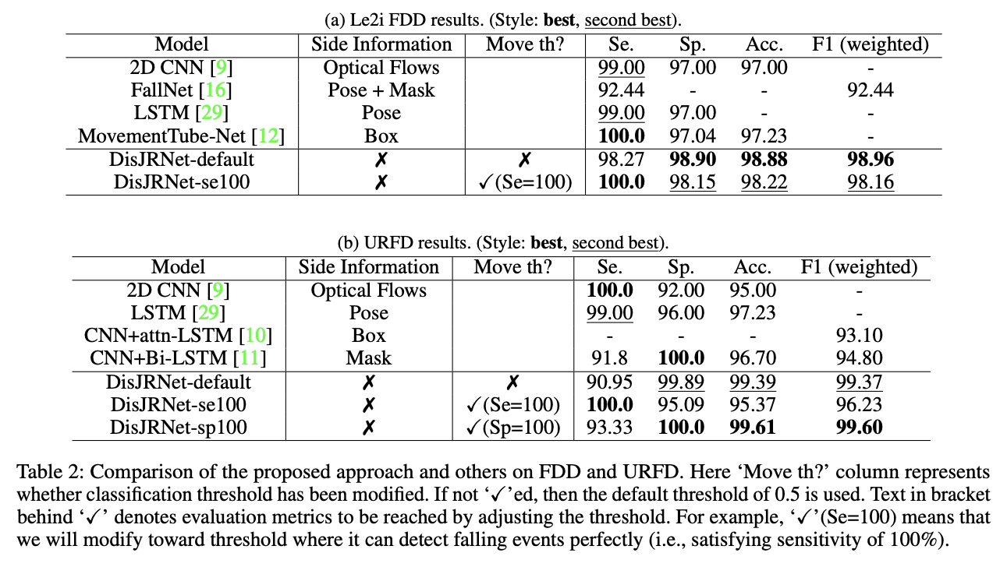
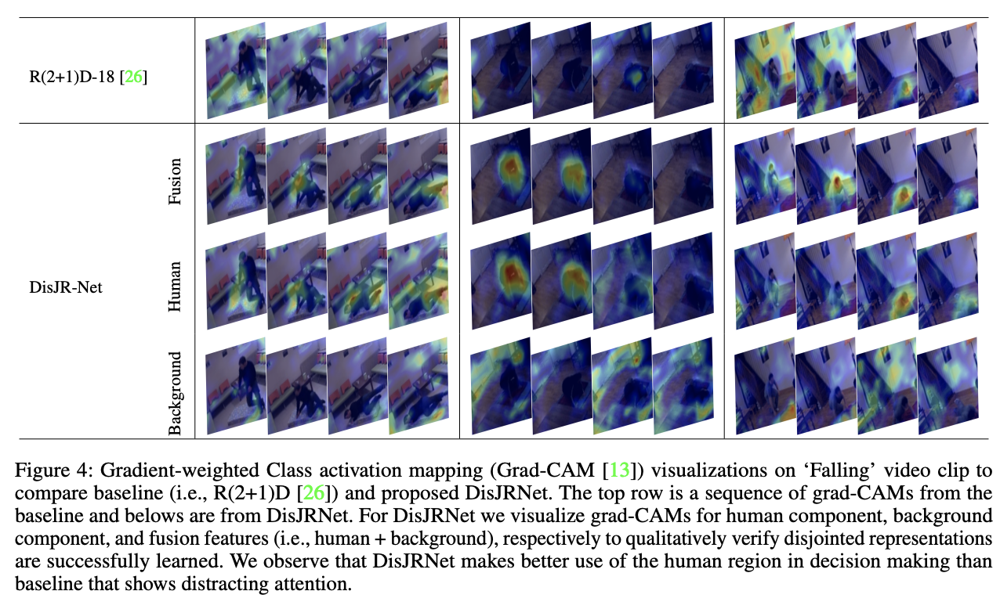

# DisJR Networks: Disjointed Representation Learning for Better Fall Recognition

## Model overview



## Usage

- DisJRNet

```bash
# FDD
python main.py --dataset FDD --root <dataset_root> --output_path <checkpoint_dir> --num_classes 2 --drop_rate 0.8 --base_model r2plus1d_18 --fusion_method gating --n_fold 5 --batch_size 8 --epochs 25 --sample_length 10 --num_workers 8 --monitor val_f1 --lr 1e-4 --c 5.0 --arch DisJRNet --gpu_ids 0

# URFD
python main.py --dataset URFD --root <dataset_root> --output_path <checkpoint_dir> --num_classes 2 --drop_rate 0.8 --base_model r2plus1d_18 --fusion_method gating --n_fold 5 --batch_size 8 --epochs 25 --sample_length 10 --num_workers 8 --monitor val_f1 --lr 1e-4 --c 2.0 --arch DisJRNet --gpu_ids 0
```

- Baseline

```bash
# FDD
python main.py --dataset FDD --root <dataset_root> --output_path <checkpoint_dir> --num_classes 2 --drop_rate 0.8 --base_model r2plus1d_18 --n_fold 5 --batch_size 8 --epochs 25 --sample_length 10 --num_workers 8 --monitor val_f1 --lr 1e-4 --arch Baseline --gpu_ids 0

# URFD
python main.py --dataset URFD --root <dataset_root> --output_path <checkpoint_dir> --num_classes 2 --drop_rate 0.8 --base_model r2plus1d_18 --n_fold 5 --batch_size 8 --epochs 25 --sample_length 10 --num_workers 8 --monitor val_f1 --lr 1e-4 --arch Baseline --gpu_ids 0
```

## Results



## Activation Map Visualization


